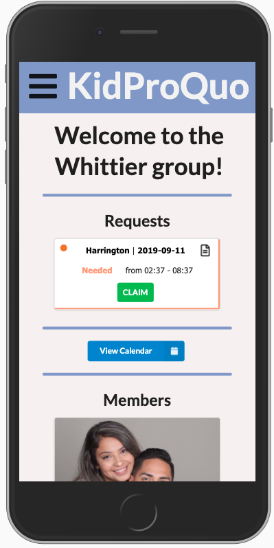

# KidProQuo
KidProQuo is a full-stack mobile application to support babysitting co-ops. Coordinating one is a lot of administrative paperwork and groups often fall apart because people are asking for sitters, but not available to “sit” for others. The goals of this application are to reduce the administrative burden, to support transparency, and promote accountability and fairness so all parents are able to have some free time out.

## Built With
- Javascript
- React
- JSX
- React Sagas
- React Redux
- Node.js
- Express.js
- Postgres
- Sql
- Twilio
### Prerequisites
Before you get started, make sure you have the following software installed on your computer:
- [Node.js](https://nodejs.org/en/)
- [PostrgeSQL](https://www.postgresql.org/)
- [Nodemon](https://nodemon.io/)
### Installing
1. Download this project.
2. `npm install`
3. `npm run server`
4. `npm run client`
Create a new database called `KidProQuo`, use data from `database.sql` file.
## Screen Shot

## Documentation

To view documentation click [HERE](https://docs.google.com/document/d/11xMQpjgZem_SRj-wrgJU4MFJIyHZKh2GdKi73QyqwZk/edit?usp=sharing)

### Completed Features
- [x] User can login and navigate to the group they are a member of and see other member's profiles
- [x] User can track their `hour equity` easily by the 'hour bar' on their profile page
- [x] User can create a request for 'time needed' or 'time offered' and leave notes for other users about the event
- [x] User can update their family's profile and 'add a child'
- [x] User will get a text message when an event of theirs has been claimed or confirmed
### Next Steps 
- [ ] Creating and editing 'groups'
- [ ] Sending invites to become a member of a group
- [ ] Ability to upload photo from user's device
## Deployment

Try this app for yourself! Click [Here](https://limitless-thicket-89875.herokuapp.com/#/)

## Authors
* Sean Olson
* Sam Flavin
* Kyle Olson
* Danielle Martain
## Acknowledgments
* Prime Digital Academy